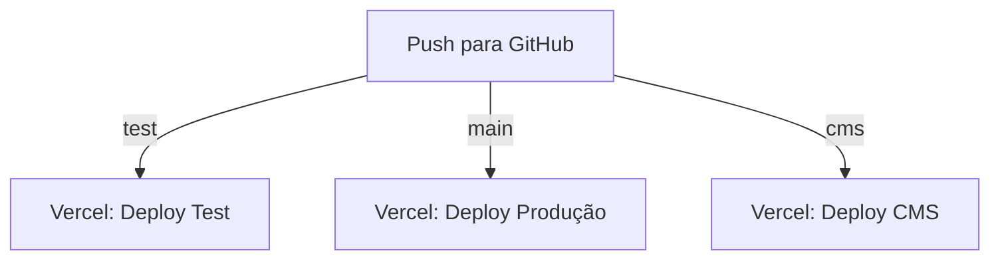

# 🌐 NUMORAQ - Infraestrutura Git, Vercel, Supabase e CI/CD

## 📦 Estrutura Geral

### 🔀 Git (1 repositório, 3 branches)

| Branch  | Ambiente       | URL                         | Descrição                                                |
|---------|----------------|-----------------------------|----------------------------------------------------------|
| `main`  | Produção       | https://numoraq.online      | App oficial com dados reais                              |
| `test`  | Staging/Teste  | https://test.numoraq.online | Testes e QA (usando Supabase real com leitura segura)    |
| `cms`   | Produção CMS   | https://cms.numoraq.online  | Painel administrativo com acesso total ao banco PROD     |

---

## ⚙️ Vercel (3 projetos conectados ao GitHub)

| Projeto         | Branch  | Domínio                 | Supabase usado                   | CI/CD                            |
|-----------------|---------|-------------------------|----------------------------------|----------------------------------|
| NumoraQ App     | `main`  | `numoraq.online`        | Supabase PROD                    | ✅ Deploy automático via push    |
| NumoraQ Test    | `test`  | `test.numoraq.online`   | Supabase PROD (leitura segura)   | ✅ Deploy automático via push    |
| NumoraQ CMS     | `cms`   | `cms.numoraq.online`    | Supabase PROD                    | ✅ Deploy automático via push    |

> CI/CD configurado via **integração GitHub → Vercel**, com builds individuais por branch.

---

## 🗃️ Supabase (2 projetos)

| Projeto Supabase | Ambiente  | Finalidade                         | Observações                                     |
|------------------|-----------|------------------------------------|-------------------------------------------------|
| `numoraq-prod`   | Produção  | App principal + CMS admin           | Protegido com RLS e service role               |
| `numoraq-test`   | Staging   | Ambiente opcional para testes       | Usado apenas se for necessário gravar dados    |

---

## 🔐 Variáveis de Ambiente

### `.env.production` (`main`)
```env
SUPABASE_URL=https://prod.supabase.co
SUPABASE_ANON_KEY=prod_anon_key
```

### `.env.staging` (`test`)
```env
SUPABASE_URL=https://prod.supabase.co
SUPABASE_ANON_KEY=prod_anon_key
SUPABASE_ENV=test
```

### `.env.cms` (`cms`)
```env
SUPABASE_URL=https://prod.supabase.co
SUPABASE_SERVICE_ROLE_KEY=prod_service_role_key
```

---

## 🔐 Segurança no acesso ao banco de produção

### ✅ Estratégia de RLS para test usar banco real com segurança:
```sql
-- Exemplo de RLS somente leitura
CREATE POLICY "Allow read for staging env"
  ON public.user_points
  FOR SELECT
  USING (
    current_setting('request.supabase_env', true) = 'test'
  );
```

Configure o JWT ou headers para enviar:
```ts
set_config('request.supabase_env', 'test', true);
```

### 🛡️ Proteção extra por role (CMS)
- CMS usa `SUPABASE_SERVICE_ROLE_KEY` (chave com acesso completo, nunca exposta no frontend)
- O CMS se conecta apenas ao banco de produção
- Ideal proteger CMS com autenticação (OAuth restrito ou IP Whitelist)
- Recomendado usar `auth.role = 'admin'` ou tabela `admin_users` com RLS

---

## 🔁 Fluxo CI/CD



- Cada push em `main`, `test` ou `cms` aciona build e deploy automático no projeto correspondente
- As variáveis de ambiente no Vercel são separadas por projeto

---

## ✅ Tabela Final: Resumo de Ambientes

| Parte   | Ambiente Teste? | Banco Usado      | CI/CD              | Notas Importantes                           |
|---------|-----------------|------------------|--------------------|---------------------------------------------|
| App Web | ✅ Sim          | Supabase PROD    | ✅ Via Vercel (test) | Com RLS restrita (somente leitura)         |
| CMS     | ❌ Não          | Supabase PROD    | ✅ Via Vercel (cms)  | Total acesso via service_role              |
| Banco   | 2 projetos      | PROD + opcional TEST | —               | Pode ter schema/test separado se necessário |
| GitHub  | 3 branches      | main, test, cms  | ✅ CI/CD por branch | Fluxo independente, mas sincronizado via merge |

---

## 🔄 CI/CD: Merge de test → main publica em produção

⚠️ **Importante**: Ao desenvolver no branch `test`, você estará publicando mudanças no ambiente de staging (test.numoraq.online), com acesso ao banco de produção via RLS restrita.

✅ Quando o merge de `test` para `main` é feito, o código é publicado automaticamente em numoraq.online (produção), acessando o mesmo banco de dados real (Supabase PROD), mas agora sem as restrições de leitura apenas.

### 🧠 O que isso significa?
- Use o `test` para validar componentes, lógica e layout sem risco de mutações destrutivas
- O banco de dados é o mesmo (PROD), mas a diferença está nas políticas de acesso (RLS) e no nível de confiança
- O merge para `main` promove a funcionalidade oficialmente para o público
- CI/CD da Vercel garante publicação automática após cada merge

---

## 🧠 Recomendado

✅ Testar completamente no ambiente `test` antes de promover via merge  
✅ Evitar colocar mutações perigosas no frontend de `test`  
✅ Usar feature flags, comentários e checklists nos Pull Requests  
✅ Garantir que variáveis sensíveis e permissões RLS estejam bem definidas  
✅ Monitorar os logs do Supabase para atividade inesperada  
✅ Habilitar backups automáticos no Supabase Pro  

---

📄 **Última atualização**: 2025-07-17  
🔒 **Responsável técnico**: @guilherme-myr-grovve